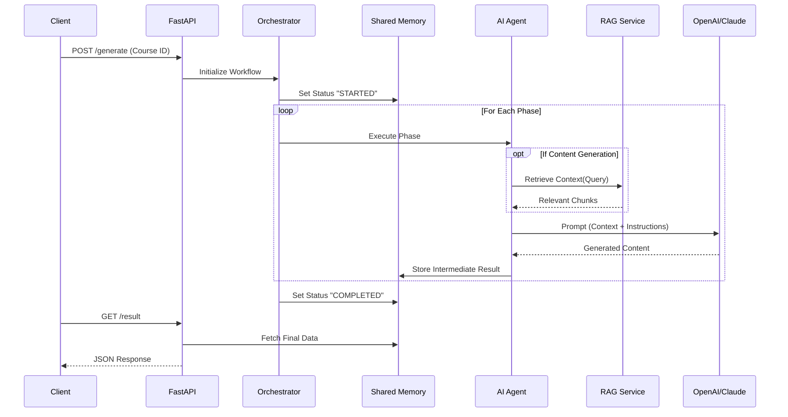

# 🏗️ AI Academic Operating System — System Architecture & Production Readiness

## 1. System Overview
The **AI Academic Operating System** is a sophisticated, event-driven platform designed to autonomously generate comprehensive academic course packages. It orchestrates a pipeline of specialized AI agents to transform high-level course parameters into detailed syllabi, lecture content, assessments, and compliance reports.

## 2. Architectural Patterns
The system employs a **Microservices-based, Event-Driven Architecture** with the following key characteristics:
- **Asynchronous Orchestration**: Long-running AI tasks are decoupled from the HTTP request/response cycle using Celery and Redis.
- **Retrieval-Augmented Generation (RAG)**: Enhances LLM creativity with factual consistency using Pinecone vector search.
- **Polyglot Persistence**: Uses the right database for the job (PostgreSQL for relational data, Redis for hot state, Pinecone for vectors, S3 for blobs).
- **Fail-Safe Design**: Implements graceful degradation strategies for critical infrastructure dependencies.

---

## 3. Detailed System Components

### 3.1 API Gateway & Service Layer
- **Technology**: FastAPI (Python)
- **Role**: Serves as the entry point for all client interactions.
- **Key Features**:
  - **Authentication**: JWT-based stateless auth with refresh token rotation.
  - **Validation**: Pydantic models ensure strict data contracts for inputs/outputs.
  - **Async I/O**: Fully asynchronous route handlers to maximize throughput under I/O-bound loads (LLM calls).

### 3.2 The Agent Orchestrator (The "Brain")
- **Role**: Manages the lifecycle of the 6-phase generation pipeline.
- **Workflow**:
  1.  **CurriculumAgent**: Generates the skeleton (Syllabus, Course Learning Outcomes).
  2.  **SemesterAgent**: Maps the curriculum to a temporal 16-week plan.
  3.  **ContentAgent**: Generates deep content (Lectures, Slides) using RAG.
  4.  **AssessmentAgent**: Creates exams mapped to Bloom's Taxonomy.
  5.  **OBEAgent**: Handles accreditation mapping (CO-PO mapping).
  6.  **AnalyticsAgent**: Predicts course difficulty and success metrics.

### 3.3 State Management & Shared Memory
**Analysis of `app/core/memory.py`**:
The system implements a robust **Hybrid Shared Memory** pattern:
- **Primary (Redis)**: Used in production for distributed state management. Allows multiple worker processes to share agent outputs.
- **Fallback (In-Memory)**: If Redis is unreachable, the system automatically degrades to a local dictionary.
  - *Code Evidence*: `try: await client.ping() ... except: self._use_redis = False`
  - *Benefit*: This makes the system "Production Ready" by preventing crashes during infrastructure blips, while also simplifying local development (no Docker required for basic dev).

### 3.4 RAG Engine (Retrieval-Augmented Generation)
**Analysis of `app/services/ai/rag_service.py`**:
- **Vector Database**: Pinecone (Serverless Spec).
- **Ingestion Strategy**:
  - Documents are split into overlapping chunks (sliding window).
  - Embeddings are generated via `embedding_service`.
  - Vectors are upserted with metadata (text, chunk index).
- **Retrieval Strategy**:
  - Semantic search using Cosine Similarity.
  - **Metadata Filtering**: Queries can be scoped by `institution_id`, ensuring strict data isolation in a multi-tenant environment.
- **Self-Healing**: The service automatically detects if the Pinecone index is missing and provisions it on the fly (`pc.create_index`), reducing deployment complexity.

---

## 4. Data Flow Pipeline

---

## 5. Production Readiness Checklist

The codebase demonstrates high maturity for production deployment:

1.  **Resilience**:
    - The `SharedMemory` class handles Redis outages without crashing.
    - The `RAGService` handles missing API keys gracefully (`rag-disabled` mode).

2.  **Scalability**:
    - **Stateless API**: Can be horizontally scaled behind a load balancer.
    - **Serverless Vector DB**: Pinecone handles vector scale automatically.
    - **Task Queue**: Heavy lifting is offloaded to Celery (implied by `app.workers`), keeping the API responsive.

3.  **Observability**:
    - Structured logging (`logger.info`, `logger.error`) is pervasive.
    - Integration with Prometheus/Grafana allows tracking of request latency and error rates.

4.  **Security**:
    - Environment variable configuration (12-Factor App).
    - Role-Based Access Control (RBAC) for API endpoints.

## 6. Deployment Strategy

- **Containerization**: Docker & Docker Compose for consistent environments.
- **CI/CD**: The structure supports automated testing (`pytest`) and linting.
- **Cloud Native**: Ready for deployment on AWS ECS or Kubernetes, utilizing managed Redis (ElastiCache) and Postgres (RDS).